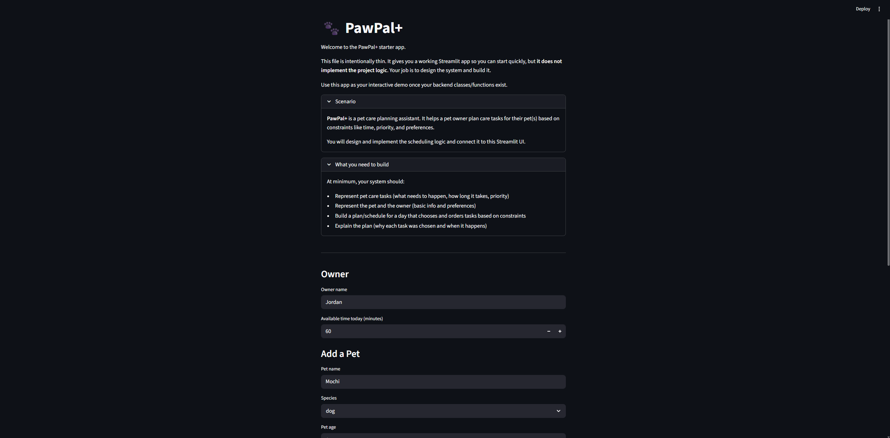

# PawPal+ (Module 2 Project)

PawPal+ is a Streamlit app that helps a pet owner plan and organize daily pet care.

## Features

- Add pets and store their care tasks in a persistent Streamlit session.
- Sort tasks by scheduled time in `HH:MM` format.
- Filter tasks by pet name or completion status.
- Prioritize required and higher-priority tasks when generating a daily plan.
- Automatically create the next occurrence for daily and weekly recurring tasks.
- Detect task conflicts and show warning messages when two tasks share the same date and time.
- Explain why tasks were selected for the daily schedule.

## 📸 Demo

<a href="/course_images/ai110/pawpal_app_screenshot.png" target="_blank"></a>

## Scenario

A busy pet owner needs help staying consistent with pet care. They want an assistant that can:

- Track pet care tasks like walks, feeding, medication, enrichment, and grooming.
- Consider constraints such as available time, priority, and owner preferences.
- Produce a daily plan and explain why it chose that plan.

## Smarter Scheduling

PawPal+ includes several scheduling features beyond basic task entry:

- Tasks can be sorted by scheduled time in `HH:MM` format.
- Tasks can be filtered by pet name or completion status.
- Daily and weekly recurring tasks automatically create the next occurrence when completed.
- The scheduler detects simple conflicts when two tasks are scheduled for the same date and time.
- The daily plan prioritizes required and higher-priority tasks while staying within the owner's available time.

## Testing PawPal+

Run the automated tests with:

```bash
python -m pytest
```

The test suite currently covers task completion, adding tasks to pets, chronological sorting, daily recurrence, and conflict detection.

Confidence Level: `★★★★☆ (4/5)`

## Getting Started

### Setup

```bash
python -m venv .venv
source .venv/bin/activate  # Windows: .venv\Scripts\activate
pip install -r requirements.txt
```

### Suggested Workflow

1. Read the scenario carefully and identify requirements and edge cases.
2. Draft a UML diagram with classes, attributes, methods, and relationships.
3. Convert the UML into Python class stubs.
4. Implement scheduling logic in small increments.
5. Add tests to verify key behaviors.
6. Connect your logic to the Streamlit UI in `app.py`.
7. Refine the UML so it matches what you actually built.
